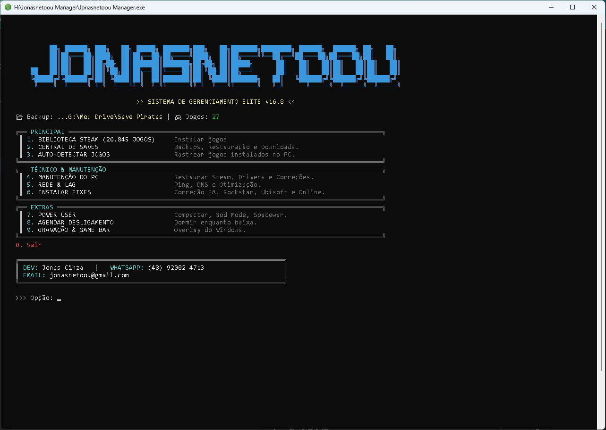
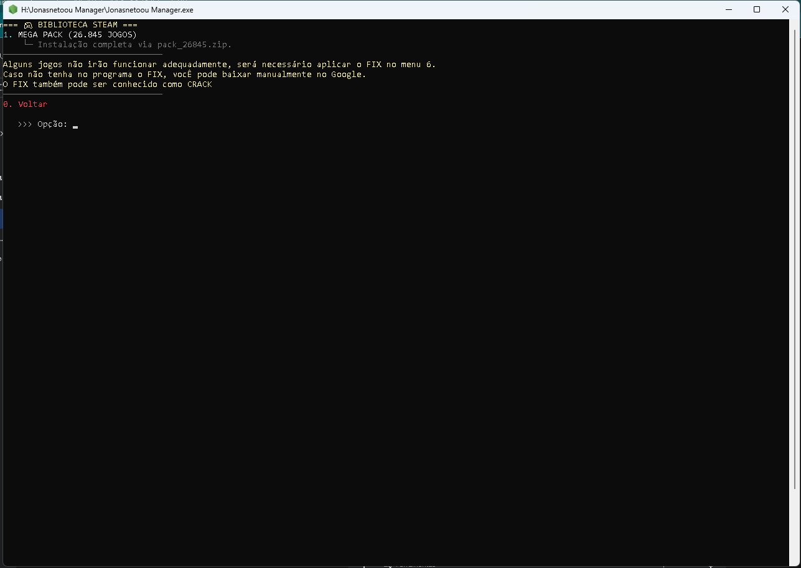
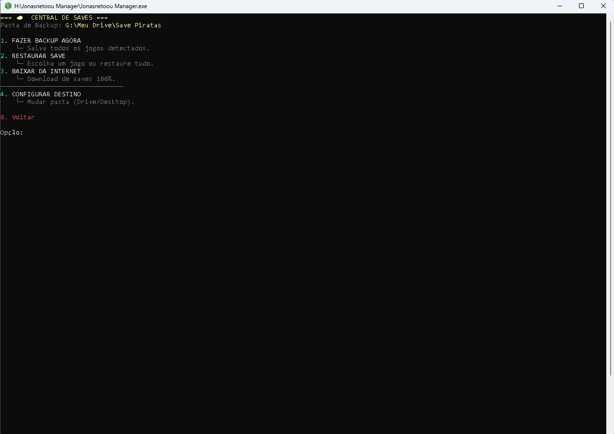
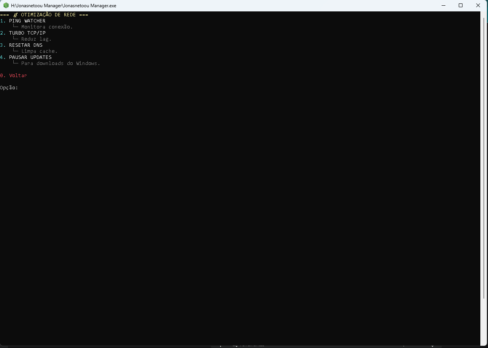

# Sistema-de-Gerenciamento-Elite-v16.8
Ferramenta de automação de alto nível desenvolvida em Node.js para otimização extrema de ambientes Windows voltados a jogos e produtividade. O projeto aplica conceitos de Arquitetura Modular e rigor técnico de engenharia para manipular registros do sistema, gerenciar arquivos de configuração e automatizar processos complexos da plataforma Steam.

**🛠️ Estrutura e Funcionalidades Principais**

O script é um menu CLI (Interface de Linha de Comando) avançado que utiliza Node.js para interagir diretamente com o sistema operacional. Ele possui as seguintes divisões principais:

**1. Gestão de Biblioteca e "Injeção"**
 
**Mega Pack (26.845 jogos):** O sistema não baixa instaladores comuns. Ele injeta metadados (.acf) e limpa o cache da Steam (appinfo.vdf) para que a plataforma reconheça os jogos como instalados nativamente, permitindo o download direto dos servidores oficiais da Valve.

**Instalação de Fixes (Menu 6):** Oferece um catálogo de correções para jogos da EA, Rockstar, Ubisoft e correções para modo Online, automatizando a extração de arquivos para as pastas dos jogos.

**2. Central de Saves**
   
**Backup e Restauração:** Permite salvar o progresso dos jogos em pastas locais ou diretamente no Google Drive.

**Download de Saves 100%:** Automatiza a busca no Google por arquivos de save game completos para o jogo selecionado.

**3. Manutenção e Performance**

**Kit Médico:** Atalhos para instalar redistribuíveis essenciais como Visual C++ e DirectX.

**Otimização:** Inclui scripts para ativar o Modo de Alto Desempenho, otimizar o TCP/IP para reduzir lag e adicionar exclusões no Windows Defender para evitar que cracks sejam deletados.

**Protocolo de Limpeza:** Função para remover arquivos "fantasmas" da Steam e limpar instaladores inúteis de pastas comuns.

**🖥️ Design System e Interface**

**Destaque:** O menu força uma resolução de 160 colunas por 55 linhas para garantir um aspecto "Ultra-Wide" no CMD/PowerShell.

**Identidade:** O cabeçalho exibe o logo em ASCII art e as informações de contato do desenvolvedor (Jonas Cinza).

**🔍 Pontos Técnicos Observados**

**Segurança:** O script verifica se está sendo executado como Administrador (necessário para comandos como net session e dism).

**Automação:** Uso extensivo de child_process para executar comandos PowerShell e shutdown do Windows.

**Integração:** O sistema é capaz de detectar automaticamente jogos instalados através do escaneamento da pasta userdata da Steam.

# 🎮 Sistema de Gerenciamento Elite v16.8
> Desenvolvido por Jonas Cinza (jonasnetoou)

## 📸 Screenshots do Sistema

### 🖥️ Interface Principal
O menu principal oferece acesso rápido a todos os módulos de gerenciamento, manutenção e otimização.

---

### 📦 Módulos em Detalhes

| 🎮 Biblioteca Steam | ☁️ Central de Saves |
|:---:|:---:|
|  |  |
| Gerenciamento e injeção de megapacks. | Backup e restauração (Local/Nuvem). |

| 🛠️ Manutenção do PC | 📡 Otimização de Rede |
|:---:|:---:|
|  |  |
| Drivers, Modo Performance e Kit Médico. | Ping Watcher e ajustes de latência. |

---

### 🌀 Funções Extras (Power User)
Ferramentas avançadas para controle total do sistema operacional e da plataforma Steam.

**Entre outras funções não listadas nas capturas de tela.**

